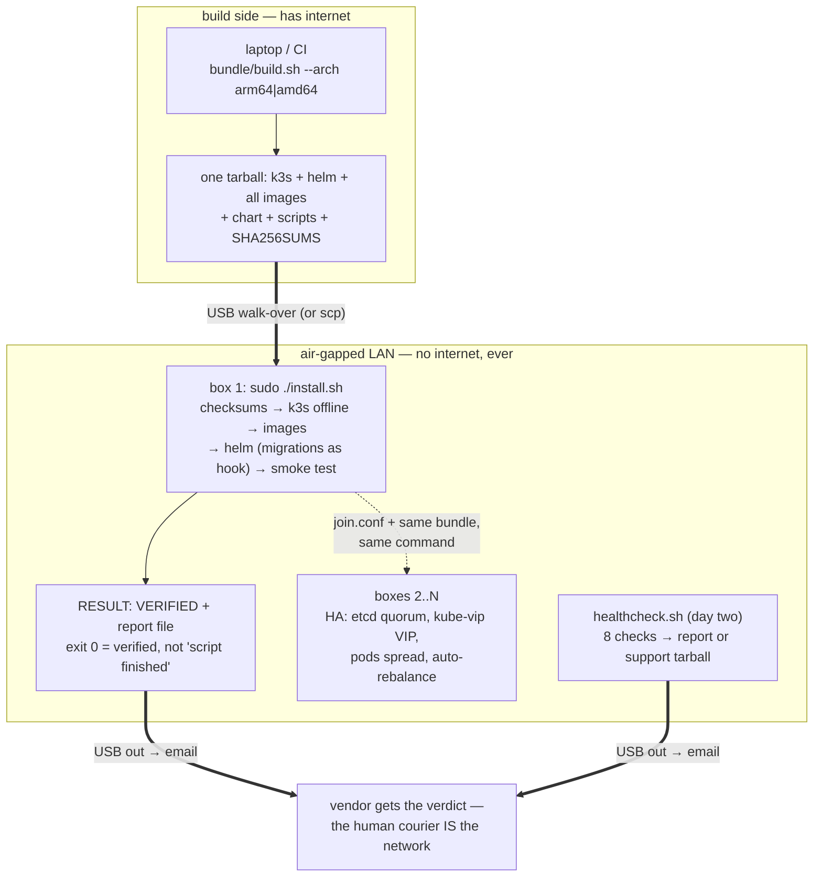

# Air-gapped on-prem deploy

Doing some role playing. I'm pretending I need to install ([Saleor](https://github.com/saleor/saleor): GraphQL API, Postgres, Valkey, Celery) to a bare-metal box with **no internet in either direction**. It should be more or less a 1 command install that can be done copying files from a USB to a server.

> **🆕 Multi-node, HA, still fully air-gapped.**
> The same bundle now builds a x-node k3s cluster: embedded etcd, a floating virtual IP (kube-vip), pods spread across machines, and a power-cut node recovers in **~99 seconds**
> with the service answering throughout then gets work rebalanced onto it automatically when it returns. No internet anywhere at any point
> nodes just have to be on the same LAN. One command per box, the only difference being a `join.conf` file carried with the bundle.
> Drills are scripted: `scripts/drill.sh <node>` kills a node for real and verifies the recovery.

The setup: a blank Ubuntu server, SSH only from inside the customer's network, zero outbound, and an operator who isn't an engineer but can run one command and email back whatever it prints. Everything in this repo follows from those constraints. The plan is in [PLAN.md](PLAN.md). The stuff that actually broke while building it is in [NOTES.md](NOTES.md), which is honestly the most interesting file here.

## Quick start

Grab the one tarball for your arch from [Releases](../../releases), or build
it yourself on a machine with internet and docker:

```bash
./bundle/build.sh --arch amd64        # or arm64 → bundle/dist/release/<name>.tar.gz
```

Get it onto the box (USB or scp), then on the box:

```bash
tar xzf saleor-airgap-*.tar.gz
cd saleor-airgap-*/
sudo ./install.sh
```

Config gets generated into `/etc/saleor/install.conf`, keep it, upgrades need it. When it prints `RESULT: VERIFIED`, the report file next to it is the proof, and `https://saleor.local/dashboard/` works from any machine on the box's network (needs a hosts-file entry, and the cert is self-signed so the browser will complain once).

**Multi-node:** install the first box with a VIP (`sudo CLUSTER_VIP=<free-LAN-ip> ./install.sh`) — it writes a `join.conf` next to its report. Carry that file, with the bundle, to each additional box and run the same `sudo ./install.sh`. `ROLE=server` in the file joins the control plane (keep the count odd), `ROLE=agent` joins a worker. See [docs/multi-node.md](docs/multi-node.md).

## How it works



The operator runs `./healthcheck.sh`. Eight checks, one file out, a report when healthy, a support tarball (logs, describes, events) when not. That file goes out on a USB stick and gets emailed to me. The human courier
is the network.

Upgrades are just another bundle. Images accumulate in containerd, helm keeps revisions, migrations run as a pre-upgrade hook so new code never serves against an old schema. Rollback is `helm rollback` (the old images never left the box) plus a pre-upgrade pg_dump for the cases helm can't fix, helm rolls back code, not data. See [docs/upgrade-rollback.md](docs/upgrade-rollback.md).

Every command in there has been run for real, including the deliberately broken upgrade.

## Layout

```
bundle/build.sh        builds the per-arch bundle. runs on the laptop/CI, never the box
bundle/box-install.sh  host installer: k3s + images + cluster roles. self-contained bash
bundle/push.sh         dev loop: rsync bundle + chart + scripts to the test boxes
install.sh             the one command the operator runs: config + install + smoke test + report
healthcheck.sh         day-two checks → report file or support bundle
chart/                 helm chart, the entire runtime definition
scripts/               test rig: clone VMs, network preflight, failure drills
docs/                  manual install runbook, upgrade/rollback, multi-node plan
.github/workflows/     tag a version → CI builds arm64 + amd64 bundles onto a Release
```

The layering rule: `install.sh` is UX and verification, `box-install.sh` is host setup and release shipping, the chart is the runtime. The box never needs the internet for anything — `imagePullPolicy: Never` everywhere, so a violation fails loudly instead of silently pulling. There's no ansible or any config-management tool in the bundle on purpose; NOTES.md #9 is the story of why I dropped it.

## Status

Single node, demonstrated on an air-gapped arm64 VM (VirtualBox host-only network, no route out): one-shot install from blank → VERIFIED, survives reboot, upgrade v0.1.0 → v0.2.0, a deliberately broken upgrade that failed without taking the running stack down, rollback, and a backup restore.

Multi-node, demonstrated on a 3-VM rig on the same gapped network: HA control plane (embedded etcd + kube-vip VIP), one-command joins from the same bundle, postgres pinned to a labeled data node with its backups, api spread across nodes, and a scripted power-cut drill — 99s to full redundancy with GraphQL answering throughout, automatic rejoin, automatic rebalance (descheduler).

Still to do: the x86_64 bare-metal pass on a real machine.
